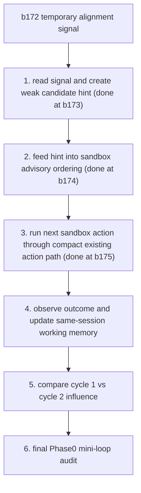

# Phase0 Minimal Learning Action Memory Loop Plan

Status: planning document only.
Runtime impact: none.
Boundary Index impact: none.

This plan does not grant runtime capability. Current capability claims remain controlled by:

- `docs/current_boundary_index.md`
- `docs/phase0_status.md`
- `docs/phase0_capability_matrix.md`

## Goal

Phase 0 should end with a small, observable, repeatable sandbox loop:

```text
first cycle experience
-> same-session working memory
-> next-cycle thought read
-> weak candidate hint
-> candidate ordering changes in sandbox
-> next sandbox action
-> outcome
-> comparison showing the second cycle was influenced by the first
```

Plain meaning:

Qingyin should be able to use what just happened in the same sandbox session to slightly change what she considers next.

This is not long-term learning.
This is not production behavior.
This is not proof of consciousness.

## Current Starting Point

Current endpoint at plan creation:

```text
Boundary Index: 2026-06-09-b172

b169 advisory reordering evidence
-> b170 one-cycle thought / action / working-memory mini-loop trace
-> b171 record-only consistency evaluation
-> b172 same-session sandbox-only temporary alignment signal
```

b172 creates a temporary record-only marker that the thought preview, action evidence, and working-memory update lined up.

b172 does not allow readback, candidate hints, reordering, action creation, memory write, predictor influence, production behavior, or proof claims.

Current progress:

```text
Boundary Index: 2026-06-09-b175

b172 temporary alignment signal
-> b173 same-session signal readback
-> b173 weak candidate_input_only hint
-> b174 same-session sandbox advisory ordering
-> b175 compact same-session sandbox action/outcome path
```

b173 creates weak hints for `reach_front_item`, `wait_or_observe`, and `observe_or_alternative_probe`.

b174 uses those hints to change same-session sandbox advisory ordering while preserving the candidate set.

b174 still does not allow selected_action, final_action, direct command, execution, new outcome observation, score mutation, runtime next-cycle ordering, memory write, predictor influence, production behavior, or proof claims.

b175 runs the b174 top hinted candidate through one compact same-session sandbox action path. It creates selected_action, final_action, direct_command, one sandbox execution, and outcome observation records for reach, wait, and probe scenarios.

b175 still does not allow working-memory update from the second-cycle outcome, feedback evaluation/application, candidate reordering, candidate score mutation, runtime next-cycle ordering, long-term memory/retention write, predictor influence, direct endocrine/tendency feed, production behavior, consciousness claim, or proof claim.

## Completion Definition

Phase 0 minimal loop is complete when a deterministic sandbox test can show:

```text
cycle_count == 2
temporary_same_session_memory_used == true
candidate_hint_created == true
next_cycle_candidate_ordering_changed == true
second_cycle_action_uses_hint_path == true
outcome_observed == true
working_memory_updated_after_second_cycle == true
sandbox_only == true
long_term_memory_written == false
production_behavior_created == false
proof_of_learning_claim == false
```

Human wording:

The system can show that the second sandbox cycle was nudged by the first cycle's temporary memory, while staying temporary, sandbox-only, and honest about what it proves.

## Non-Goals

Phase 0 does not aim to prove:

- awakening
- subjective feeling
- full autonomy
- production action ability
- long-term learning
- stable habit formation
- persistent memory growth
- predictor improvement
- semantic vision
- real-world tool operation

Phase 0 also should not keep adding boundary-only packages that do not produce a new visible capability.

## Route



## Step 1: Signal Readback And Candidate Hint

Status: completed at Boundary Index b173.

Plain result:

The system reads the temporary "the loop lined up" signal once in the same session and turns it into a weak candidate hint.

This step should create:

- signal readback record
- candidate hint record
- deterministic hints for the existing reach / wait / probe scenarios
- CLI
- tests
- smoke

It must not create:

- candidate reordering
- selected_action
- final_action
- direct command
- execution
- new outcome observation
- long-term memory write
- retention write
- predictor influence
- production behavior
- proof of learning

## Step 2: Candidate Hint Into Ordering

Status: completed at Boundary Index b174.

Plain result:

The weak hint enters sandbox advisory candidate ordering and changes the order in a small, visible way.

This step should create:

- before ordering
- hint-influenced ordering
- preserved candidate set
- reason trace showing the hint was used

It must not create:

- selected_action
- final_action
- direct command
- execution
- candidate score mutation outside this record
- runtime next-cycle ordering outside the sandbox demo
- memory write
- production behavior
- proof of learning

## Step 3: Ordering To Next Sandbox Action

Status: completed at Boundary Index b175.

Plain result:

The top hinted candidate can move through the already established sandbox action path as a compact next-cycle sandbox action.

This step may use a compact package because selected_action, final_action, direct command, execution, and outcome observation have already been proven in earlier sandbox-only lines.

This step should create:

- selected_action
- final_action
- direct_command
- one sandbox execution
- outcome observation
- trace links back to the hint-influenced ordering

It must not create:

- external tool operation
- production behavior
- working_memory_update
- feedback evaluation/application
- candidate reordering
- long-term memory write
- retention write
- predictor mutation
- open-ended action loop
- proof of learning

## Step 4: Outcome To Same-Session Working Memory

Plain result:

The second-cycle outcome updates same-session working memory only.

This step should create:

- outcome summary
- working_memory_update
- link to previous temporary signal
- link to candidate hint
- link to second-cycle action/outcome

It must not create:

- Long-term Memory
- Core Memory
- Archive Memory
- retained JSONL write
- memory admission
- habit
- skill anchor
- predictor influence
- production behavior
- proof of learning

## Step 5: Two-Cycle Influence Check

Plain result:

The system compares a baseline second cycle with a hint-influenced second cycle and shows that the hint changed the sandbox candidate path.

This step should create:

- baseline ordering
- hint-influenced ordering
- deterministic comparison
- influence_visible flag
- reason trace

It must not claim:

- general learning
- long-term memory
- production readiness
- consciousness
- stable habit
- predictor improvement

## Step 6: Phase0 Mini-Loop Audit

Plain result:

The audit confirms that the minimal two-cycle sandbox loop happened and stayed inside scope.

This step should verify:

- first cycle evidence exists
- temporary same-session memory exists
- second cycle read the temporary context
- candidate hint was created
- advisory ordering changed
- next sandbox action ran
- outcome was observed
- same-session working memory updated
- no persistent memory or production behavior was created

It must not open a new capability by itself.

## Package Guidance

Avoid packages whose only result is:

```text
future X may be allowed later
```

Prefer packages with a visible output:

```text
readback exists
hint exists
ordering changed
action ran in sandbox
outcome was observed
working memory updated
two-cycle influence was measured
```

Boundary checks should remain in validators and tests, but the package itself should move the loop forward.

## Success Statement

When this plan is complete, the honest claim should be:

```text
ASHL Core can run a deterministic same-session sandbox mini-loop where first-cycle outcome context is held in temporary working memory, read by the next thought step, converted into a weak candidate hint, used to alter sandbox advisory ordering, and checked against second-cycle action/outcome evidence.
```

The honest non-claim should be:

```text
This is not long-term learning, not production behavior, not consciousness, not subjective experience, not predictor improvement, and not persistent memory growth.
```
